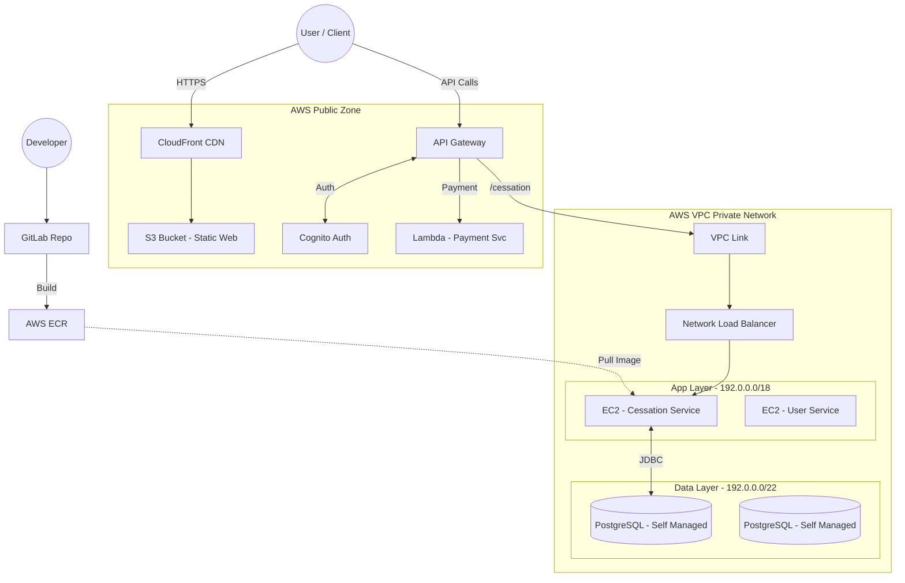

# ☁️ AWS Infrastructure & Backend Integration Flow

> **Scope:** Integration between **Cessation Service** (Codebase: `program-service`, Java 25) and the specific AWS Architecture (EC2/Serverless Hybrid).
> **Region:** `ap-southeast-1` (Singapore)
> **Architecture Style:** Hybrid Microservices (Self-managed EC2 + Serverless Lambda).

---

## 1. Kiến Trúc Tổng Quan (High-Level Architecture)

Hệ thống kết hợp giữa Frontend tĩnh (S3/CloudFront), Backend động trên EC2 (qua VPC Link) và Serverless cho thanh toán.

---

## 2. Phân Tích Chi Tiết Các Thành Phần

### 2.1. Luồng Truy Cập (Access Flow)
1.  **Frontend:** Người dùng truy cập qua **CloudFront** (để tăng tốc và SSL), nội dung tĩnh (HTML/JS) được lấy từ **S3 Bucket**.
2.  **API Gateway:** Cửa ngõ duy nhất cho mọi request backend.
    *   Tích hợp **Cognito** để xác thực (`Authentication`) và phân quyền (`Authorization`) ngay tại mép ngoài.

### 2.2. Xử Lý Logic (Backend Compute)
Hệ thống chia làm 2 nhánh xử lý tại API Gateway:

*   **Nhánh 1: Serverless (Payment)**
    *   **Công nghệ:** AWS Lambda.
    *   **Lý do:** Tiết kiệm chi phí cho các tác vụ không thường xuyên, khả năng scale vô hạn khi giao dịch tăng đột biến.

*   **Nhánh 2: Microservices (Cessation Service - Core)**
    *   **Đường đi:** API Gateway -> **VPC Link** -> **NLB** -> **EC2**.
    *   **Hạ tầng:** Service chạy dưới dạng Container (Docker) trên các **EC2 Instance** nằm trong *Backend Private Subnet*.
    *   **Cessation Service:** Đây là nơi mã nguồn `program-service` (Java 25) được triển khai.

### 2.3. Tầng Dữ Liệu (Data Layer)
*   **Mô hình:** **Self-managed on EC2** (Tự cài đặt và quản trị DB trên máy chủ ảo), không dùng RDS.
*   **Vị trí:** *DB Private Subnet* (Bảo mật cao nhất, chặn Internet).
*   **Cessation DB:** Chạy PostgreSQL trên EC2, lưu trữ các bảng `programs`, `quizzes`, `streaks`.

---

## 3. Quy Trình DevOps & Triển Khai (CI/CD)

Để đưa code Java 25 mới lên hệ thống:

1.  **Code:** Dev commit code vào **GitLab Repo**.
2.  **Build:** GitLab Pipeline chạy, build file JAR và đóng gói thành Docker Image.
3.  **Push:** Image được đẩy lên **AWS ECR** (Elastic Container Registry).
4.  **Deploy:** Pipeline kích hoạt lệnh trên EC2 (qua SSM hoặc Agent) để pull Image mới từ ECR về và khởi động lại container `Cessation Service`.

---

## 4. Bảo Mật & Quản Trị

*   **Network Isolation:**
    *   Backend Subnet: Chỉ nhận traffic từ NLB/VPC Link.
    *   DB Subnet: Chỉ nhận traffic từ Backend Subnet.
*   **Access Control:**
    *   Operator dùng **EC2 Instance Connect Endpoint** để SSH an toàn vào server mà không cần mở cổng 22 ra Internet công cộng.
*   **Backup:** Có service riêng `DB Backup` chạy trên EC2 để sao lưu dữ liệu định kỳ.

---

## 5. Mapping Cấu Hình Code (Configuration)

Để `program-service` chạy đúng trong môi trường này, cần cấu hình `application.properties`:

| Key | Giá trị (Environment Variable) | Giải thích |
| :--- | :--- | :--- |
| `spring.datasource.url` | `jdbc:postgresql://<EC2_DB_PRIVATE_IP>:5432/cessation_db` | Trỏ về IP nội bộ của EC2 chứa DB. |
| `server.port` | `8080` | Port mà container lắng nghe (NLB sẽ forward vào đây). |
| `spring.security.oauth2...` | Cognito URL | Để validate token từ API Gateway chuyển xuống. |