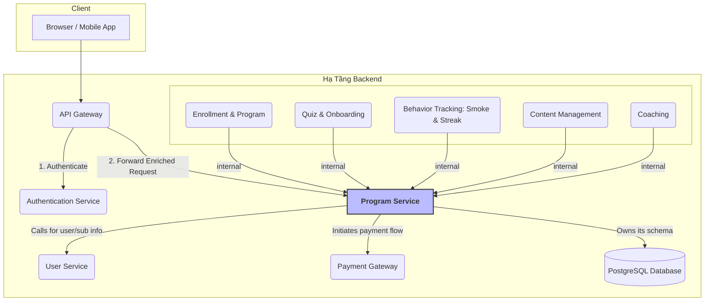
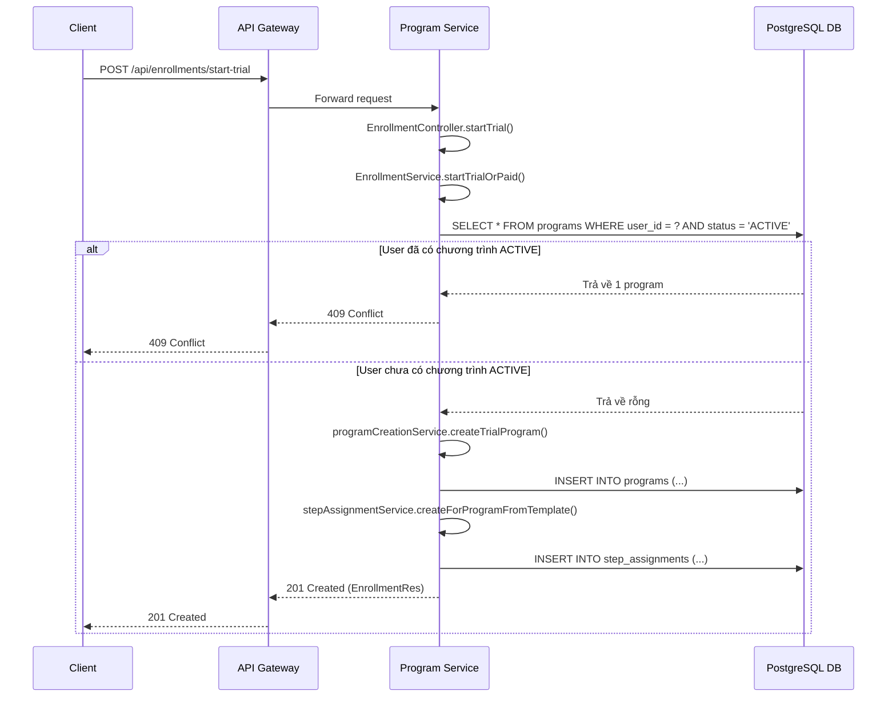
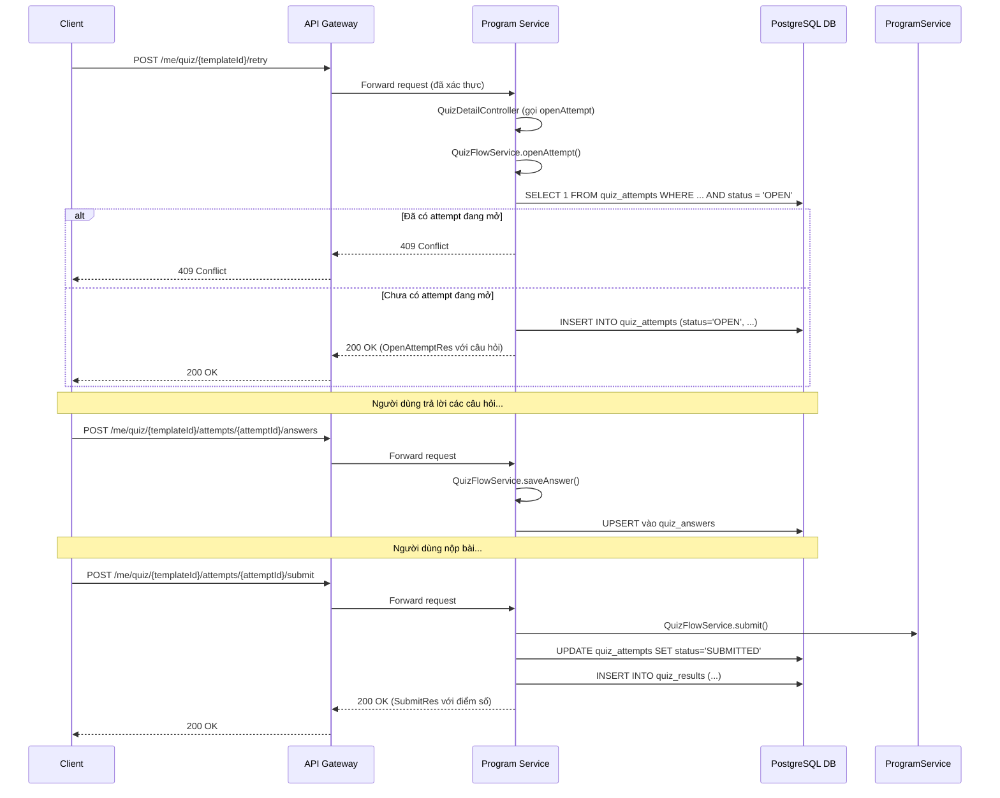
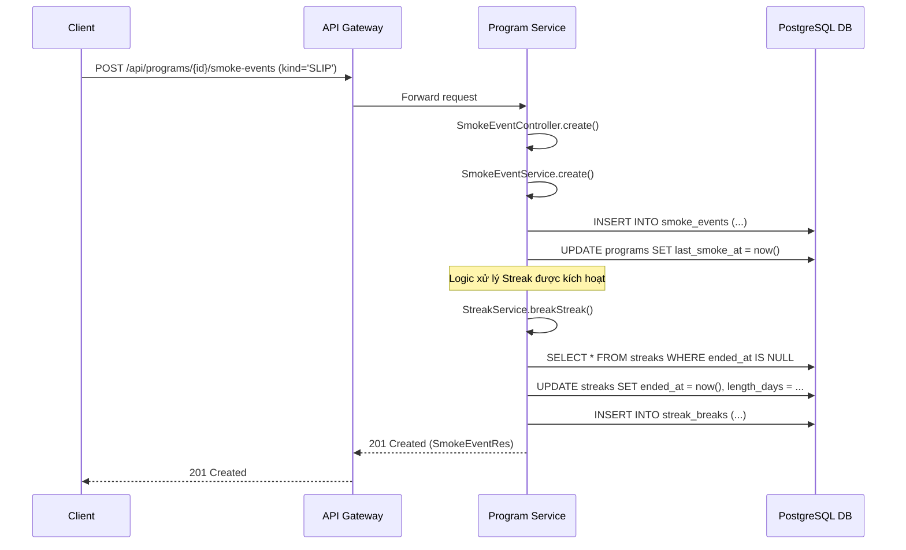
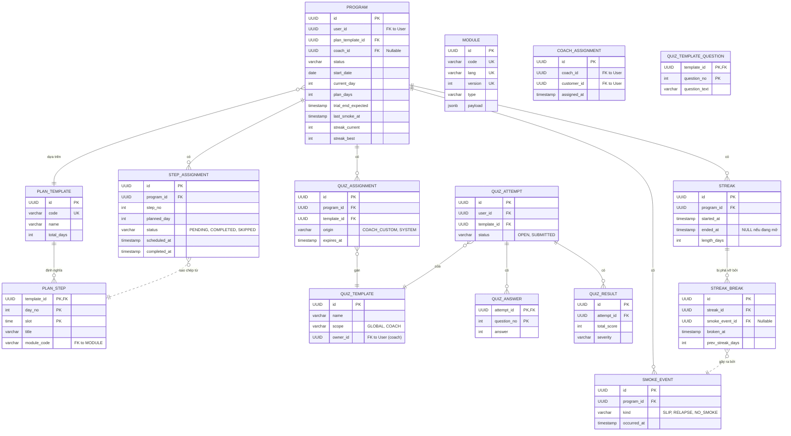

# 📖 Kiến Trúc Hệ Thống Microservice - Smoke-Free Program

**Tài liệu này mô tả kiến trúc tổng thể, luồng dữ liệu và sự tương tác giữa các thành phần trong hệ thống microservice của dự án Smoke-Free, với trọng tâm là `Program Service`.**

## 1. Tổng Quan Kiến Trúc (High-Level Architecture)

Hệ thống được xây dựng theo kiến trúc microservice. Một **API Gateway** đóng vai trò là cửa ngõ duy nhất cho mọi yêu cầu từ client. Việc xác thực được xử lý bởi một **Authentication Service** (AWS Lambda), dịch vụ này sẽ làm giàu request bằng các header (`X-User-Id`, `X-User-Group`, `X-User-Tier`) trước khi chuyển tiếp đến các service nội bộ.

- **Authentication Service**: Xác thực JWT và tiêm thông tin người dùng vào request header.
- **Program Service**: **Dịch vụ cốt lõi và phức tạp nhất**, chịu trách nhiệm cho hầu hết các nghiệp vụ của ứng dụng. Nó được chia thành nhiều domain con logic:
    - `Enrollment & Program`: Quản lý vòng đời đăng ký và trạng thái chương trình.
    - `Quiz & Onboarding`: Quản lý các bài quiz, đánh giá đầu vào và đề xuất chương trình.
    - `Behavior Tracking`: Theo dõi các sự kiện hút thuốc (`SmokeEvent`) và chuỗi ngày thành công (`Streak`).
    - `Content Management`: Quản lý nội dung học tập với cơ chế phiên bản và đa ngôn ngữ.
    - `Coaching`: Quản lý việc gán ghép và tương tác giữa Coach và người dùng.
- **User Service**: (Dự kiến) Dịch vụ bên ngoài quản lý thông tin chi tiết của người dùng và trạng thái gói đăng ký (subscription). `Program Service` sẽ gọi đến đây khi cần.
- **Payment Gateway**: (Dự kiến) Dịch vụ bên ngoài xử lý thanh toán.

---

## 2. Phân Tích Sâu Các Domain trong Program Service

### 2.1. Domain: Enrollment & Program Management
- **Trách nhiệm**: Xử lý việc người dùng tham gia chương trình, quản lý trạng thái (active, paused), và tiến độ.
- **Controllers chính**:
    - `OnboardingFlowController`: Xử lý bài quiz đầu vào và đề xuất chương trình.
    - `ProgramJoinController`, `EnrollmentController`: Cung cấp các API để người dùng bắt đầu chương trình (trial/paid).
    - `ProgramManagementController`: Cung cấp các API để quản lý một chương trình đang diễn ra (pause, resume, end, upgrade).
- **Services chính**:
    - `OnboardingFlowService`: Điều phối luồng onboarding.
    - `EnrollmentService`: **Orchestrator Service**, điều phối việc tạo chương trình.
    - `ProgramCreationService`, `StepAssignmentService`: Các service chuyên biệt được `EnrollmentService` ủy quyền.
- **Kiến trúc đáng chú ý**:
    - Luồng onboarding và enrollment được thiết kế rất tốt, tuân thủ Single Responsibility Principle.
    - Tồn tại nhiều "thế hệ" API (`ProgramJoinController` vs `EnrollmentController`), cho thấy sự tiến hóa của hệ thống.
    - `ProgramManagementController` xử lý logic trực tiếp (Fat Controller), khác với các service khác.

### 2.2. Domain: Quiz
- **Trách nhiệm**: Quản lý toàn bộ vòng đời của các bài quiz, từ việc tạo, làm bài, chấm điểm đến xem lại lịch sử.
- **Controllers chính**:
    - `QuizDetailController`: Quản lý luồng làm quiz có trạng thái (lịch sử, xem chi tiết, làm lại).
    - `QuizController`: Cung cấp API stateless để tính điểm nhanh.
    - `CoachVipQuizController`: Xử lý nghiệp vụ đặc thù clone quiz cho user VIP.
- **Services chính**:
    - `QuizFlowService`: Quản lý luồng làm quiz **stateful** (có `QuizAttempt`), chống gian lận bằng cách chỉ cho phép 1 attempt `OPEN`.
    - `QuizService`: Cung cấp logic tính điểm **stateless**, không tương tác DB.
    - `SeverityRuleService`: Hoạt động như một "rule engine" để map điểm số ra mức độ và đề xuất.
    - `CoachVipQuizService`: Thực hiện logic "deep copy" phức tạp và được bảo vệ bởi `@Transactional`.
- **Kiến trúc đáng chú ý**:
    - Tách biệt rõ ràng giữa luồng stateful và stateless.
    - Logic phân quyền tùy chỉnh phức tạp (`@authz.isCoach`).
    - Tầng service (`QuizFlowService`) đã hoàn thiện nhưng chưa được kết nối đầy đủ từ `QuizDetailController`.

### 2.3. Domain: Behavior Tracking (Smoke & Streak)
- **Trách nhiệm**: Ghi nhận các hành vi liên quan đến việc hút thuốc và quản lý chuỗi ngày thành công. Đây là trái tim của việc theo dõi tiến trình cai thuốc.
- **Controllers chính**:
    - `SmokeEventController`: Ghi lại một sự kiện hút thuốc (Command).
    - `SmokeEventDetailController`: Lấy lịch sử và thống kê (Query).
    - `StreakController`: Quản lý toàn bộ vòng đời của `Streak` (start, break, history).
- **Services chính**:
    - `SmokeEventService`: Nhận sự kiện, cập nhật `Program`, và quan trọng nhất là **kích hoạt `StreakService`**.
    - `StreakService`: Chứa logic nghiệp vụ phức tạp để bắt đầu, phá vỡ, và tính toán chuỗi ngày.
- **Kiến trúc đáng chú ý**:
    - **Event-Driven Logic**: Một `SmokeEvent` được tạo ra sẽ kích hoạt các logic khác (cập nhật `Streak`).
    - **CQRS ở cấp Controller**: Tách biệt rõ `SmokeEventController` (ghi) và `SmokeEventDetailController` (đọc).
    - **Thiết kế dữ liệu sâu sắc**: Lưu lại cả `Streak` (thành công) và `StreakBreak` (thất bại) để phục vụ phân tích.

### 2.4. Domain: Content Management
- **Trách nhiệm**: Cung cấp và quản lý nội dung học tập.
- **Controllers chính**: `ModuleController`.
- **Services chính**: `ContentModuleService`.
- **Kiến trúc đáng chú ý**:
    - Hoạt động như một **CMS (Content Management System) mini**.
    - Hỗ trợ 2 tính năng cốt lõi: **Versioning** (tự động tăng phiên bản khi tạo mới) và **đa ngôn ngữ**.
    - API được thiết kế để tối ưu cho client với việc hỗ trợ ETag caching.

### 2.5. Domain: Coaching
- **Trách nhiệm**: Quản lý việc gán ghép và tương tác giữa Coach và người dùng.
- **Controllers chính**:
    - `CoachAssignmentController`: Quản lý việc gán/hủy gán Coach-Customer.
    - `ProgramCoachController`: Quản lý việc gán Coach vào một `Program` cụ thể.
- **Services chính**: `CoachAssignmentService` (hiện đang mock).
- **Kiến trúc đáng chú ý**:
    - Tồn tại **hai cách tiếp cận song song** cho cùng một nghiệp vụ, cho thấy sự thay đổi trong thiết kế.
    - `ProgramCoachController` thao tác trực tiếp trên `ProgramRepository`, trong khi `CoachAssignmentController` được thiết kế để dùng service riêng.
    - Luồng này chưa hoàn thiện và còn nhiều `//TODO`.

---

## 3. Phân Tích Các Luồng Tương Tác Quan Trọng

### 3.1. Luồng: Bắt đầu chương trình dùng thử (Start Trial)
*Mô tả: Luồng này hoàn toàn nằm trong `Program Service`. Nó kiểm tra điều kiện, tạo các bản ghi cần thiết trong database và trả về kết quả.*

### 3.2. Luồng: Người dùng làm một bài Quiz (Stateful Quiz Flow)
*Mô tả: Luồng này thể hiện quá trình làm một bài quiz có trạng thái, được quản lý bởi `QuizFlowService` để đảm bảo tính toàn vẹn và chống gian lận.*

### 3.3. Luồng: Ghi nhận Sự kiện Hút thuốc (Event-Driven Streak Update)
*Mô tả: Luồng này thể hiện cách một hành động (ghi lại `SmokeEvent`) kích hoạt một logic nghiệp vụ quan trọng khác (cập nhật `Streak`).*

---

## 4. Mô Hình Dữ Liệu (PostgreSQL Schema)

Sơ đồ quan hệ thực thể (ERD) chi tiết của `Program Service`, bao gồm các domain chính.

