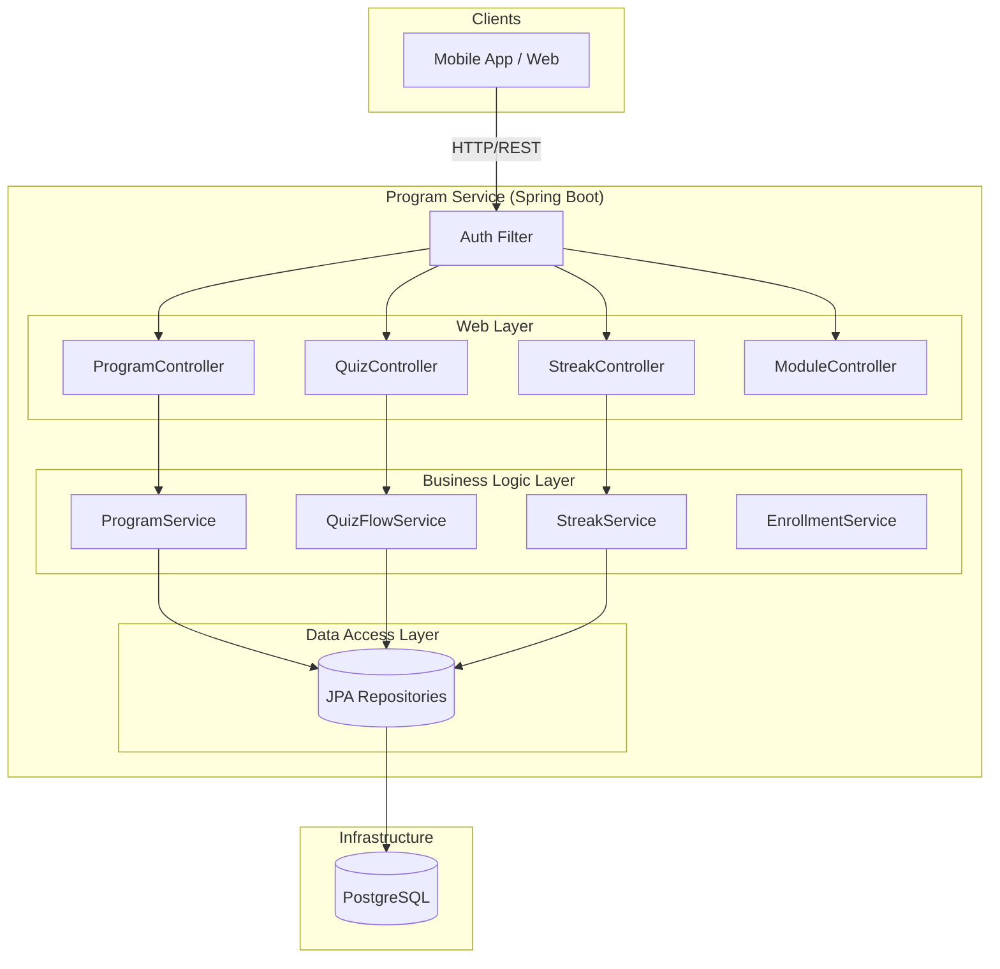
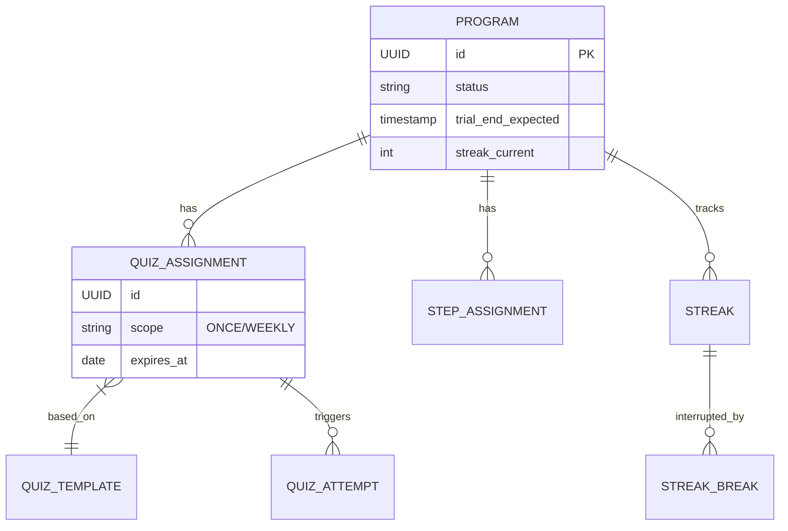

# 📖 Kiến Trúc Hệ Thống Microservice - Smoke-Free Program (V2.0)

> **Version:** 2.0 (Updated for Java 25 & Current Implementation)
> **Status:** Accurate Reflection of Source Code.

## 1. Tổng Quan Kiến Trúc (High-Level Architecture)

Hệ thống `program-service` là một **Stateful Microservice** độc lập, chịu trách nhiệm quản lý toàn bộ vòng đời cai thuốc của người dùng.

### Tech Stack
*   **Core:** Java 25 (Eclipse Temurin), Spring Boot 3.5.7
*   **Database:** PostgreSQL 14+ (Schema `program`), Flyway V42 Migration.
*   **Container:** Docker (Alpine Linux).

### Sơ Đồ Thành Phần (Component Diagram)

---

## 2. Phân Tích Các Domain Chính

### 2.1. Core Domain: Program & Enrollment
*   **Trách nhiệm:** Tạo lập và quản lý vòng đời chương trình.
*   **Class Chính:**
    *   `ProgramServiceImpl`: Service trung tâm. Quản lý trạng thái `ACTIVE/PAUSED`, kiểm tra `Trial Hard Stop`.
    *   `EnrollmentServiceImpl`: Orchestrator (Nhạc trưởng) điều phối việc tạo chương trình, tạo bài học (`StepAssignment`) và gán lịch kiểm tra (`QuizAssignment`).
*   **Logic Nổi Bật:**
    *   **Auto-Assignment:** Tự động quét `PlanTemplate` và `PlanQuizSchedule` để sinh dữ liệu cá nhân hóa cho User ngay khi đăng ký.

### 2.2. Engagement Domain: Quiz Engine
*   **Trách nhiệm:** Vận hành hệ thống đánh giá và kiểm tra định kỳ.
*   **Class Chính:**
    *   `QuizFlowServiceImpl`: Quản lý luồng làm bài (`Attempt` -> `Answer` -> `Result`).
    *   `SeverityRuleService`: Quy tắc tính điểm và xếp loại mức độ nghiện.
*   **Logic Nổi Bật:**
    *   **In-Memory Scheduling:** Tối ưu hóa hiệu năng bằng cách tải dữ liệu và tính toán ngày đến hạn (`Due Date`) trong bộ nhớ, tránh N+1 Query.
    *   **Streak Recovery Integration:** Tích hợp logic "Cứu chuỗi" ngay trong luồng nộp bài (`submit`).

### 2.3. Tracking Domain: Streak & Smoke Events
*   **Trách nhiệm:** Theo dõi hành vi và duy trì động lực (Gamification).
*   **Class Chính:**
    *   `StreakServiceImpl`: Quản lý chuỗi ngày thành công.
    *   `SmokeEventService`: Ghi nhận sự cố (relapse).
*   **Logic Nổi Bật:**
    *   **Healing Mechanism:** Khả năng "chữa lành" lịch sử (`StreakBreak`) khi người dùng hoàn thành bài học phục hồi.

### 2.4. Content Domain: Education
*   **Trách nhiệm:** CMS (Content Management System) mini cho bài học.
*   **Class Chính:** `ContentModuleServiceImpl`.
*   **Logic Nổi Bật:**
    *   **Versioning:** Không ghi đè nội dung cũ. Luôn tạo phiên bản mới (`v1`, `v2`...) để đảm bảo toàn vẹn dữ liệu cho người dùng cũ.

---

## 3. Mô Hình Dữ Liệu (Simplified ERD)

