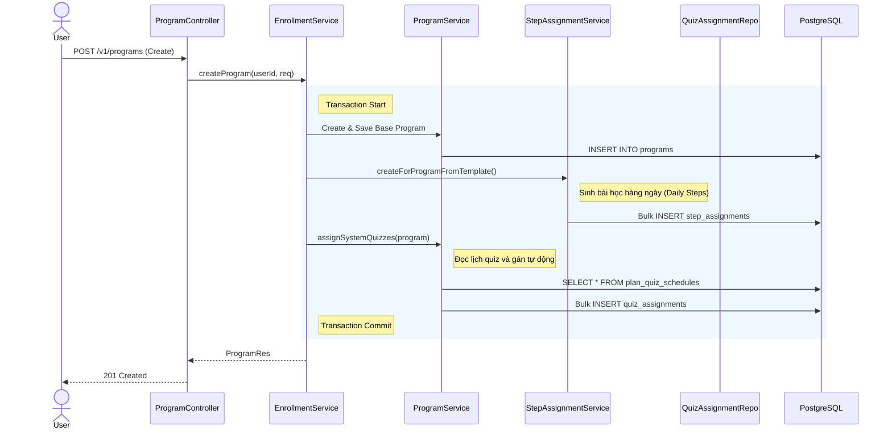
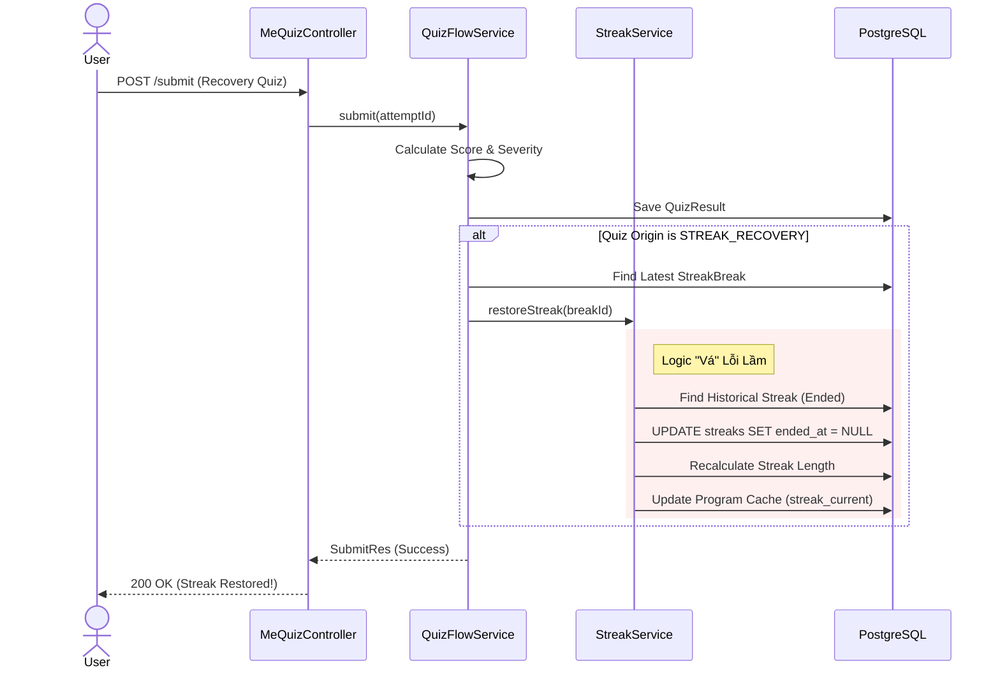
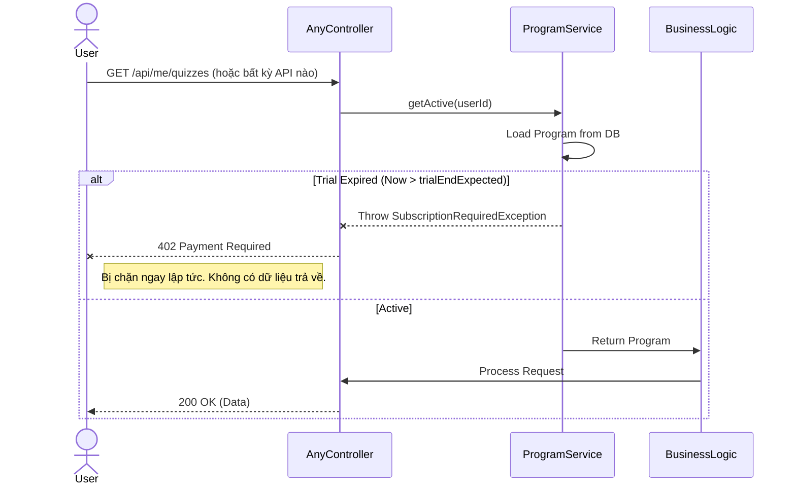

# 🔄 SYSTEM ARCHITECTURE FLOW (Luồng Xử Lý Chi Tiết)

Tài liệu này mô tả chi tiết các luồng tương tác (Sequence Diagrams) cho 3 nghiệp vụ quan trọng và phức tạp nhất của hệ thống.

## 1. Luồng Khởi Tạo Chương Trình (Program Creation & Auto-Assign)
*Khi người dùng đăng ký, hệ thống không chỉ tạo một bản ghi `Program` mà còn phải sinh ra hàng loạt dữ liệu liên quan (Steps, Quizzes).*

---

## 2. Luồng "Cứu Chuỗi" (Streak Recovery Flow) - **Killer Feature**
*Đây là logic phức tạp nhất, nơi `Quiz Engine` tương tác trực tiếp với `Streak Engine` để sửa đổi lịch sử.*

---

## 3. Luồng Kiểm Tra & Chặn Dùng Thử (Trial Hard Stop)
*Cơ chế bảo vệ thụ động (Passive Protection) để ngăn người dùng xài chùa.*

